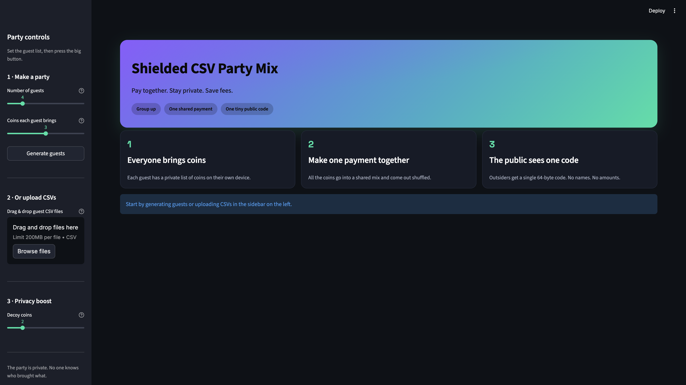
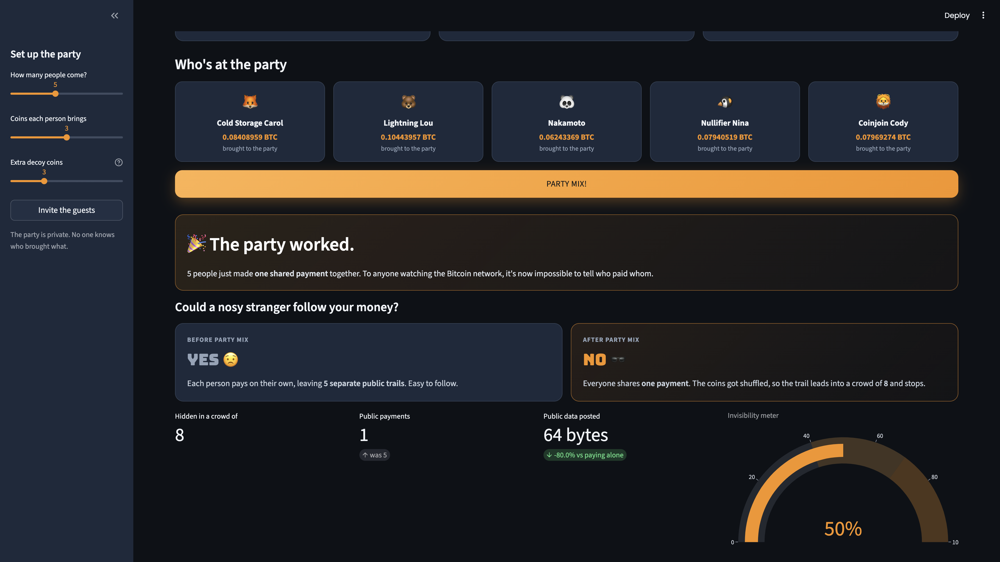

_This project was built for the 4hr cursor miami hackathon at the dock: https://www.cursormiami.com/_

# Party Mix

**Mix together. Stay private. Limit fees.**


[](https://partymix-cbu5hjo8qcvn8nayck9a2w.streamlit.app/)
[](#disclaimer)

A fun, beginner-friendly Streamlit app that shows how a group of people can pool
their Bitcoin and make **one** shared private transaction, and have the outside
world see only a single tiny **64-byte code** — not who brought what, how much,
or who took home what.

It's a CoinJoin-style mixer reimagined on top of the **Shielded CSV** idea
(private, efficient Client-Side Validation).

**▶️ Try it live: <https://partymix-cbu5hjo8qcvn8nayck9a2w.streamlit.app/>**





> ### Disclaimer
> ⚠️ **Educational demo only.** All "cryptography" is faked with random text so
> the *ideas* stay front and center. This handles **no real Bitcoin** and is
> **not safe for real money**. See [ROADMAP.md](ROADMAP.md) for what it would
> take to make this real.

---

## Quick start

```bash
pip install -r requirements.txt
streamlit run app.py
```

Then open the URL Streamlit prints (usually <http://localhost:8501>).

## Deploy to Streamlit Community Cloud

This app is ready to deploy for free on [Streamlit Community Cloud](https://share.streamlit.io):

1. Go to <https://share.streamlit.io> and sign in with GitHub.
2. Click **Create app → Deploy a public/private app from GitHub**.
3. Pick this repo (`Schellbach/partymix`), branch `main`, main file `app.py`.
   - Because the repo is **private**, authorize Streamlit to access it when prompted.
4. Click **Deploy**. Streamlit installs `requirements.txt` automatically and
   applies the theme in `.streamlit/config.toml`.

That's it — you'll get a public `*.streamlit.app` URL to share.

## How to use it

1. **Make a party** — in the sidebar, choose how many guests come and generate them.
2. **Pick decoys** — more decoy coins = a bigger crowd to hide in.
3. **Click "Mix the party"** — watch the mixing animation.
4. **Explore the dashboard:**
   - A clear **before vs after** comparison and a privacy-score gauge
   - Before/after transaction graphs (with a privacy toggle)
   - Coin-flow Sankey diagram
   - The "public view" (just the 64-byte code)
   - The merged shared payment record
   - Download buttons for every CSV

## What is Shielded CSV? (the foundation)

Normally, Bitcoin announces **every** payment to the whole world and stores it
forever — no privacy, and the ledger only grows. **Shielded CSV** flips that
around, in three pieces:

1. **Pay off the public record** — you hand the coin and a small proof *directly*
   to the person you're paying. Amounts, names, and history never touch the chain.
2. **Leave one tiny mark** — the only thing posted to Bitcoin is a 64-byte code
   called a **nullifier**. It looks like random noise and just means "this coin is
   now used," so it can't be spent twice.
3. **A proof that never grows** — a **zero-knowledge proof** travels with the coin,
   proving it's real without revealing where it's been, and it stays tiny no matter
   how old the coin is (thanks to *Proof-Carrying Data*).

The result: real privacy and ~100+ payments per second, all on top of Bitcoin
with no fork needed. Based on
[Shielded CSV (Nick, Eagen, Linus, 2025)](https://eprint.iacr.org/2025/068) and the
[Blockstream explainer](https://blog.blockstream.com/bitcoins-shielded-csv-protocol-explained/).

## The novel idea, in plain words

Normally **every spend leaves its own trail** on Bitcoin — anyone can follow the
money.

**Shielded CSV** keeps your coin details on *your* computer. The only thing
posted publicly is a tiny 64-byte fingerprint (a *nullifier*).

The **Party Mix** goes one step further: instead of each person making their own
private spend, a **group makes a single shared spend together**. Because all the
inputs and outputs live inside one transaction:

- **Cheaper** — one fingerprint on-chain instead of one per person.
- **More private** — outsiders can't link any input to any output.
- **Stronger in numbers** — decoy coins grow the crowd you blend into.

Shared accounts + a combined fingerprint = strong privacy at a fraction of the
on-chain footprint.

## Project layout

| File | Purpose |
| --- | --- |
| `app.py` | Streamlit UI, visualizations, and an inline README section |
| `mixer.py` | Core simulation: mock data, the party-mix logic, privacy metrics |
| `requirements.txt` | Python dependencies |
| `ROADMAP.md` | What it would take to go from demo to real coins |
| `docs/` | Screenshots used in this README |

## The (fake) data model

Each guest's CSV represents their private *shielded state*:

| column | meaning (plain words) |
| --- | --- |
| `account_id` | the guest's account |
| `coin_commitment` | a sealed envelope standing for a coin |
| `nullifier` | the fingerprint a coin leaves when spent |
| `amount_sats` | the coin's value in satoshis (stays private) |
| `balance_sats` | running balance |
| `proof_hash` | a stand-in for a zero-knowledge proof |
| `timestamp` | when the coin was created |
